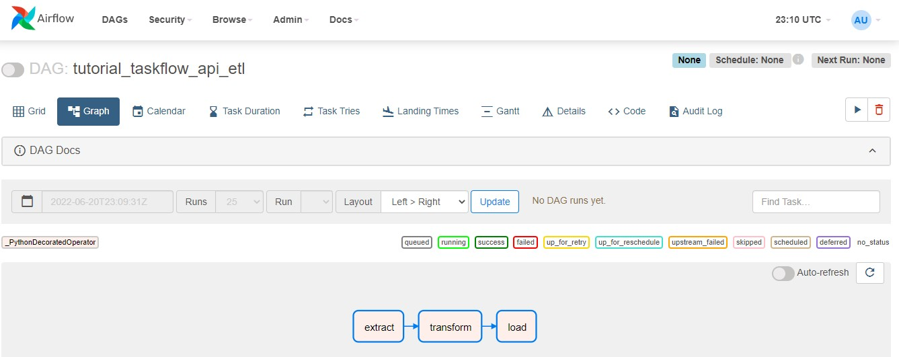

### Exercício IGTI - Modulo 4 - Bootcamp Engenheiro de dados cloud - Docker + Kubernetes + AirFlow + Spark Operator

Estudo de criação de um ambiente Kubernetes na Google Cloud, com Cloud Storage (bucket), usando as seguites ferramentas/tecnologias:

* Docker (docker file, docker job) - Docker Desktop (Windows)
* Google SDK Client (https://cloud.google.com/sdk/docs/install-sdk)
* Kubernetes Engine (pod, job, deployment e service)
* Cloud Storage
* Python
* Apache Airflow - Helm Chart for Apache Airflow (https://airflow.apache.org/docs/helm-chart/stable/index.html)
* Spark Operator
* Kubectx (https://github.com/ahmetb/kubectx)
* Kubectl
* Visual Studio Code
* Terraform (cloud storage)

Procedimento utlizado para provisionamento do Cluster Kubernetes e do Apache AirFlow:

`gcloud container clusters create airflow-cluster --machine-type e2-medium --num-nodes 1 --region "us-east1"`

`gcloud container clusters get-credentials airflow-cluster --region "us-east1"`

`kubectl create namespace airflow`

`helm repo add apache-airflow https://airflow.apache.org`

`helm repo list`

`helm upgrade --install airflow apache-airflow/airflow -n airflow --debug`
 OU 
`helm install airflow apache-airflow/airflow -n airflow --debug`

`kubectl port-forward svc/airflow-webserver 8080:8080 -n airflow`

`helm show values apache-airflow/airflow > airflow/my_values.yaml`

`helm upgrade --install airflow apache-airflow/airflow -n airflow -f airflow/my_values.yaml --debug`

`gcloud container clusters delete airflow-cluster --region "us-east1"`

