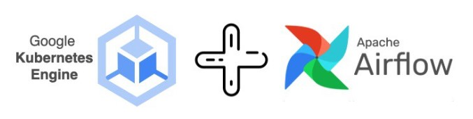

## Docker + Kubernetes + AirFlow

<div align="center">



</div>

Estudo de caso de um ambiente Kubernetes na Google Cloud, com Cloud Storage (bucket), como parte do Módulo 4 do curso de MBA em Engenharia de Dados - IGTI - Bootcamp Engenheiro de dados Cloud, usando as seguites ferramentas/tecnologias:

* <a href='https://docs.docker.com/desktop/windows/install/'>Docker Desktop</a>
* <a href='https://cloud.google.com/sdk/docs/install-sdk'>Google SDK Client</a>
* GCP Kubernetes Engine (pod, job, deployment e service)
* GCP Cloud Storage
* <a href='https://www.python.org/downloads/'>Python</a>
* <a href='https://airflow.apache.org/docs/helm-chart/stable/index.html'>Helm Chart for Apache Airflow</a>
* <a href='https://github.com/ahmetb/kubectx'>Kubectx</a>
* <a href='https://chocolatey.org/install#individual'>Chocolatey</a>
* <a href='https://kubernetes.io/docs/tasks/tools/install-kubectl-windows/'>Kubectl</a>
* <a href='https://code.visualstudio.com/download'>Visual Studio Code</a>
* <a href='https://www.terraform.io/downloads'>Terraform</a>

### Procedimento utlizado para provisionamento do Cluster Kubernetes e do Apache AirFlow:

Cria o Cluster do Kubernetes no GCP via CLI:<br>
```gcloud container clusters create airflow-cluster --machine-type e2-medium --num-nodes 1 --region "us-east1"
```

Autoriza conexão através do Kubectl:<br>
`gcloud container clusters get-credentials airflow-cluster --region "us-east1"`

Cria a namespace airflow:<br>
`kubectl create namespace airflow`

Configura o repo oficial do Helm Chart do Apache AirFlow:<br>
`helm repo add apache-airflow https://airflow.apache.org`

Visualiza os dados do repo:<br>
`helm repo list`

Atualiza o repo:<br>
`helm repo update`

Efetua a instalação do pacote padrão (helm chart) do Apache AirFlow no Kubernetes:<br>
`helm upgrade --install airflow apache-airflow/airflow -n airflow --debug`

Permite acesso da console web atraves pelo localhost:<br>
`kubectl port-forward svc/airflow-webserver 8080:8080 -n airflow`

Cria um arquivo yaml para que seja possivel customizar o chart do AirFlow:<br>
`helm show values apache-airflow/airflow > airflow/my_values.yaml`

Atualiza a instalação com as alterações realizadas no arquivo my_values.yaml:<br>
`helm upgrade --install airflow apache-airflow/airflow -n airflow -f airflow/my_values.yaml --debug`

Apaga o cluster de Kubernetes no GCP:<br>
`gcloud container clusters delete airflow-cluster --region "us-east1"`
